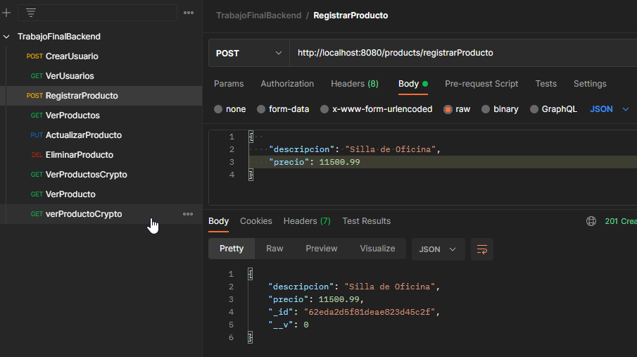
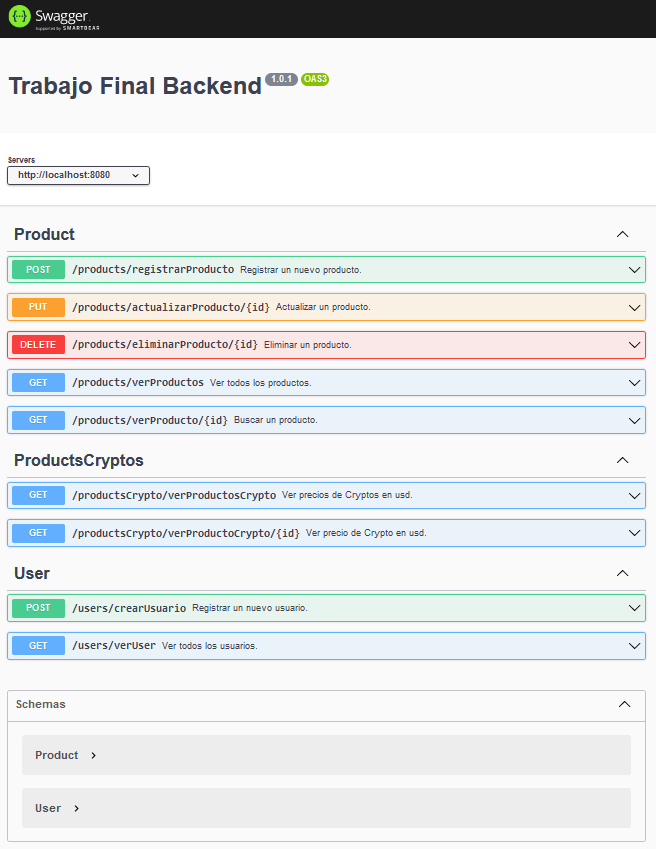

<h1  align="center">Academia Numen Desarrollo Web Full Stack</h1>

<h3  align="center">Autor: Osvaldo Colmenares</h3>  

🔭 Proyecto Backend **fs-1021** 

  Postman
   
    Las colecciones para probar los endpoint están en la carpeta "coleccionParaPostman".
       
   
  Swagger
   
   Los endpoint también se pueden probar utilizando swagger (http://localhost:8080/swagger/)
   
   
  

<h4  align="left">Lenguajes y herramientas:</h4>

        

